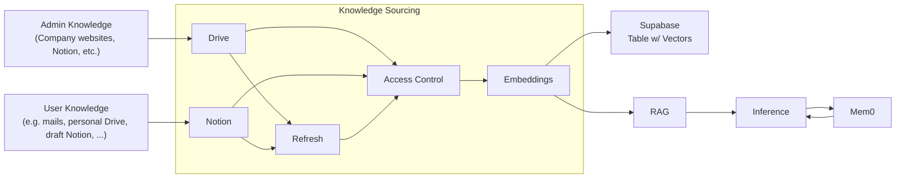
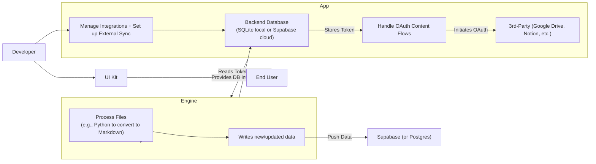

# Knowledge Sourcing & Engine Architecture

## Knowledge Sourcing

<Info>
Below is the Mermaid diagram representing the Knowledge Sourcing pipeline, explaining how data is ingested, processed, and stored.
</Info>

### Explanation

- **Knowledge Sourcing subgraph**: Demonstrates the ingestion pipeline from Drive and Notion through Refresh, Access Control, and Embeddings.
- **Admin/User Knowledge**: External sources feeding into the system.
- **Supabase, RAG, Inference, Mem0**: Shows AI feature pipelines (RAG-based retrieval, inference, and memory functionality).

---

## Engine & App Architecture

<Info>
The following Mermaid diagram illustrates how the Engine processes files and interacts with the App, which manages integrations, OAuth flows, and storage.
</Info>

### Explanation

- **Engine**: Processes files (e.g., converts to Markdown) and updates the database.
- **App**: Manages integrations, tokens, and OAuth flows with external providers.
- **Developer**: Configures integrations.
- **UI Kit & End User**: Users interact with UI components to connect their accounts.
