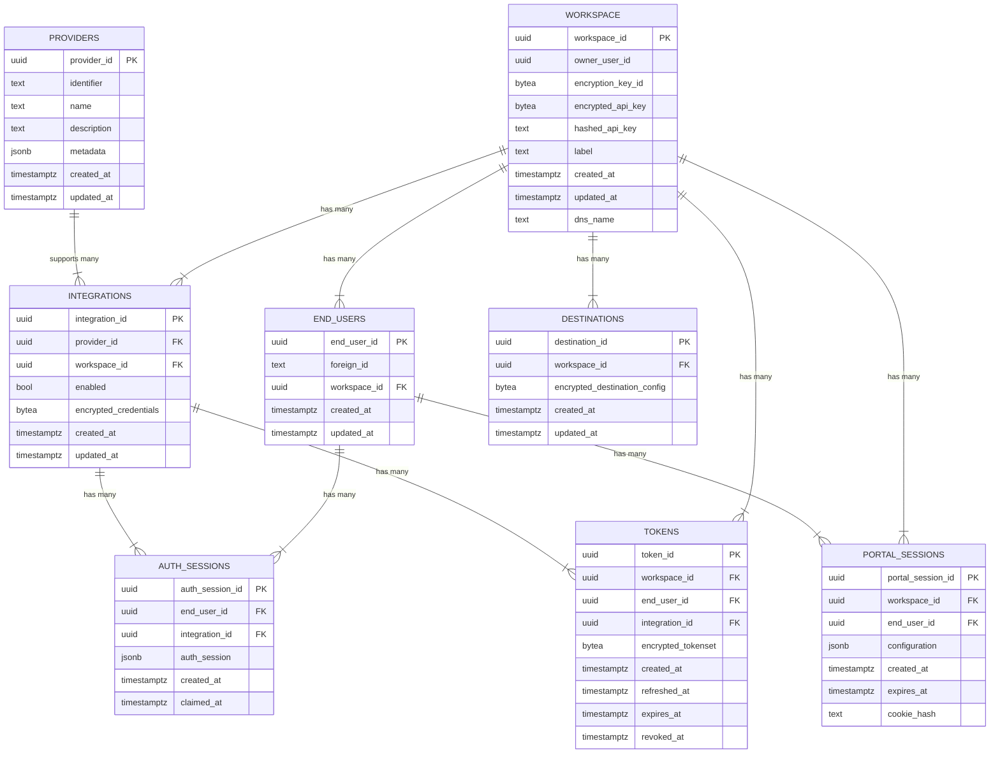

# Database & Entities

Swiftgum uses a relational schema to manage workspaces, integrations, tokens, and user sessions. This design enforces secure and scalable storage of credentials, session data, and more. Below is a high-level view of how tables connect to each other.

<Info>
Encryption & Credentials
Sensitive fields—like **API keys** and **OAuth tokens**—are stored in an encrypted format, often leveraging a dedicated vault or encryption layer. This ensures that even if the database is accessed, the credentials remain secure.
</Info>

## Entity Relationship Overview

<Card title="Note" img="/images/diagram.png">
The above diagram is a simplified representation. It doesn’t show every column or constraint but highlights the core relationships.
</Card>

<Card title="How It All Ties Together">
  <h3>Workspace</h3>
  
Each developer or company sets up a workspace. They configure integrations (with providers) to enable OAuth for end users.

  <h3>Providers & Integrations</h3>
  <ul>
    <li>A single Provider can serve multiple Integrations (e.g., dev vs. prod).</li>
    <li>Each Integration has <code>encrypted_credentials</code> (client secrets, etc.).</li>
  </ul>

  <h3>End Users & Tokens</h3>
  <ul>
    <li>End users link personal accounts.</li>
    <li>Swiftgum stores their OAuth tokens in the Tokens table, ensuring each token is encrypted and bound to a single workspace + integration.</li>
  </ul>

  <h3>Sessions</h3>
  <ul>
    <li>Auth Sessions handle the in-progress OAuth flow.</li>
    <li>Portal Sessions let an end user temporarily access the Swiftgum portal UI to manage their connections.</li>
  </ul>

  <h3>Destinations</h3>
  
Where processed or extracted data gets written (e.g., Supabase or local Postgres). Also stored securely, with connection info in <code>encrypted_destination_config</code>.

  <h3>Queue Ingestions</h3>
  
Tracks new or updated documents for ingestion. The Engine processes these items into a normalized format or embeddings.

  
By splitting data across these entities, Swiftgum ensures secure, scalable, and modular handling of user data, credentials, and ingestion flows.

</Card>
