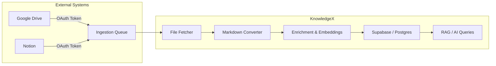

KnowledgeX automates the retrieval, conversion, and indexing of documents from multiple external sources (e.g., Google Drive, Notion). This ensures your AI workflows have **fresh, consistent data**. The steps below outline how files are fetched, transformed, and made available for AI use cases.

---

## 1. Overview


<Steps>

  <Step title="User Grants Access">
    A user connects their Google Drive or Notion through the OAuth flow, granting Mintlify API permission to access their documents.
  </Step>

  <Step title="Ingestion Queue">
    Mintlify API monitors new or updated files and records them in the `QueueIngestions` table for processing.
  </Step>

  <Step title="File Fetcher">
    Retrieves the actual file content from the provider (Google Drive or Notion) using API requests.
  </Step>

  <Step title="Markdown Converter">
    Converts files (PDF, DOCX, HTML, etc.) into a standardized Markdown format for consistent processing.
  </Step>

  <Step title="Enrichment & Embeddings">
    Optionally applies text classification, metadata extraction, or vector embeddings for AI-powered retrieval.
  </Step>

  <Step title="Storage">
    Processed content and embeddings are securely stored in Supabase/Postgres, making them easily accessible for queries.
  </Step>

  <Step title="AI Queries (RAG) & Docs API">
    - Retrieval-Augmented Generation (RAG) enables advanced AI-powered searches over stored documents.
    - Mintlify Docs API provides structured access to documentation, allowing seamless frontend integration.
  </Step>

</Steps>

## 2. Triggering Ingestion
KnowledgeX supports both automatic and manual triggers.

<Info>
    **Automatic Sync**
    By default, KnowledgeX periodically checks each integration for new/updated files. You can customize these intervals in the **Integrations** or **Configuration** panel.
</Info>

Manual Trigger via API
```js
// Example call using the KnowledgeX client
await knowledgeXClient.triggerIngestion({
  endUserId: 'user_123',
  integrationId: 'integration_abc',
  fileIds: ['doc_456']
})
```

  <ParamField query="endUserId" type="string" required={true}>
    Identifies which user’s account to check.
  </ParamField>

  <ParamField query="integrationId" type="string" required={true}>
    Specifies which integration (e.g., Google Drive).
  </ParamField>

  <ParamField query="fileIds" type="string[]" required={false}>
    If provided, limits ingestion to specific files. Otherwise, the system will scan the user’s entire drive/folder for changes.
  </ParamField>


## 3. Processing Logic
<AccordionGroup>
    <Accordion title="File Fetch & Content Extraction">
        - **Check OAuth Token**: KnowledgeX uses the user’s stored token to fetch documents from the provider’s API. - **Rate Limiting**: Some providers (Google, Notion) have daily or per-minute quotas. KnowledgeX automatically handles retry logic.
    </Accordion>
    <Accordion title="Markdown Conversion">
        - **Text Extraction**: For PDFs, `.docx`, or other formats, KnowledgeX parses text content. - **Standardization**: The extracted text is saved as Markdown, ensuring consistency across different file types. - **Metadata Insertion**: Timestamps, user IDs, and file references are inserted as YAML frontmatter or JSON.
    </Accordion>
    <Accordion title="Embeddings & Enrichment">
        - **Optional Step**: If configured, each chunk of text is passed to an embedding model (e.g., OpenAI, local model) for vector representation. - **Storage**: Vectors + text are then stored in Supabase/Postgres. - **Entity Tagging**: If an enrichment pipeline is set up, KnowledgeX can label or tag documents (e.g., categories, named entities).
    </Accordion>
</AccordionGroup>

## 4. Access Control & Visibility
During ingestion, KnowledgeX validates user permissions. If a user revokes access or the integration is disabled, the ingestion process halts for that user’s files. Additionally:

RBAC: Only users with proper roles can see or query these newly ingested documents.
Audit Logs: Ingestion events are logged (including file metadata and timestamps).

## 5. Debugging Ingestion Issues
<Steps>
    <Step title="Check the Logs">
    Look for ingestion-related messages in KnowledgeX server logs or the **admin panel logs**.
    </Step>
    <Step title="QueueIngestions Table">
    The `QueueIngestions` table tracks each file’s status (*queued, in-progress, done, error*). Inspect failed jobs for error messages.
    </Step>
    <Step title="Verify OAuth Tokens">
    Confirm the user’s token is valid and not expired.
    </Step>
    <Step title="API Rate Limits">
    Some providers (e.g., Google) might throttle calls if the ingestion scans too many files at once.
    </Step>
</Steps>
6. Next Steps
With documents ingested and processed, you can leverage Retrieval-Augmented Generation (RAG), advanced AI queries, or data analytics.

Check out the RAG & LLM Integration guide to learn how to query these newly ingested documents in your AI workflows.