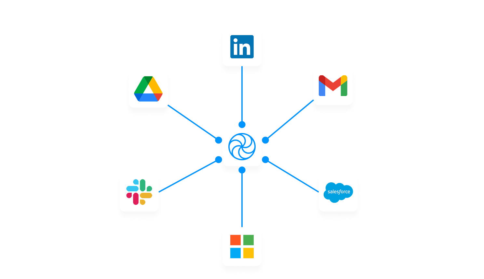
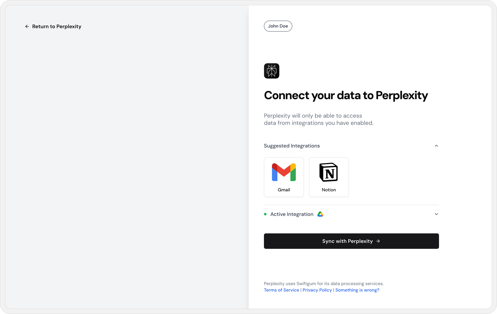

# **Swiftgum**

**Turn Data into LLM-Ready Markdown**

Swiftgum is an **open-source** platform that **ingests and normalizes documents from virtually any platform, making them ready for AI-powered applications**. It simplifies data ingestion, **enforces per-user RBAC**, and **exports structured data via webhooks**, so you can send AI-ready content anywhere you need.



---

## **Features**

✅ **Document Ingestion & Normalization** ([Docs](https://swiftgum.mintlify.app/usage/ingestion-processing))

> Extracts, cleans, and converts files from Google Drive, Notion, and more into **AI-ready Markdown**.

✅ **Multi-User RBAC** ([Docs](https://swiftgum.mintlify.app/architecture/high-level-architecture))

> Per-user data sharing rules enforced **automatically**, eliminating permission headaches.

✅ **Webhook-Based Export** ([Docs](https://swiftgum.mintlify.app/getting-started/quick-start))

> Push processed data **to any vector database, storage, or custom pipeline**—you stay in control.

✅ **OAuth-Based Authentication** ([Docs](https://swiftgum.mintlify.app/security/rbac))

> Securely connect integrations without exposing global credentials.

✅ **Self-Host or Use Swiftgum Cloud** ([Docs](https://swiftgum.mintlify.app/getting-started/installation))

> Run it yourself or get started instantly with **our managed cloud**.

---

## **Quick Start**

This guide walks you through setting up Swiftgum in five simple steps.

### **1. Sign Up & Retrieve API Key**

- **Sign Up**: Visit [Swiftgum](https://app.swiftgum.com/) and create an account.
- **Reveal Your API Key**:
  - Log into your **admin dashboard**.
  - Access the **API Keys** section to copy your `x-api-key`.

### **2. Activate an Integration**

- Navigate to **Integrations** in the Swiftgum dashboard.
- Enable an integration (e.g., Google Drive):
  - Toggle the integration status to **Enabled**.
  - Enter OAuth Credentials: Provide **Client ID** and **Client Secret** (or leave blank if pre-configured).
  - Click **Update Integration** to save changes.

Once enabled, end users can connect personal or team accounts via the **Swiftgum Portal**.

### **3. Create a Portal Session**

- Call the `/api/portal/session` endpoint to generate a `sessionId` for a specific user.
- This session allows them to manage their newly enabled integration.

#### **Example Request:**

```bash
POST /api/portal/session
Host: https://api.swiftgum.com
x-api-key: <YOUR_SWIFTGUM_API_KEY>
Content-Type: application/json

{
  "uniqueUserId": "user-123@myapp.com",
  "configuration": {
    "userDisplay": "MyUser",
    "returnUrl": "https://example.com"
  }
}
```

#### **Example Response (200):**

The response contains a **signed URL** that the developer can directly use in the UI.

```text
	"https://api.swiftgum.com/portal/sess_abc123"
```


_The Swiftgum Portal interface where users can manage their integrations and permissions_

### **4. Redirect User to the Portal**

- Use the **signed URL** returned in the API response to directly connect the end user to Swiftgum.

- Redirect your user to that **signed URL** (e.g., from a "Manage Knowledge" button in your app).
- Users can **authorize Google Drive** (or any enabled integration) and set **permissions**.
- Once finished, they will be sent back to your specified `returnUrl`.

### **5. Configure a Webhook Destination**

- Navigate to **Webhook Destination** in your **Swiftgum admin dashboard**.
- Specify your **Endpoint** (e.g., `https://api.yourdomain.com/swiftgum-webhook`).
  - Swiftgum will send **new or updated content** to this endpoint after each fetch.
- **Verify Delivery**: Swiftgum will send a **test POST request** to validate connectivity.

Once configured, your system can **automatically receive structured data** for storage, AI workflows, or additional processing.

#### **Example Webhook Response:**

```json
{
  "endUser": [
    {
      "end_user_id": "45d3de52-2e65-4f67-b61e-6f3c768b0224",
      "foreign_id": "titouan.launay@hotmail.com",
      "workspace_id": "95b3acd3-d881-4cfc-b53e-4edd9f36230a",
      "created_at": "2025-02-20T11:06:43.281Z",
      "updated_at": "2025-02-20T11:06:43.281Z"
    }
  ],
  "metadata": {
    "tokenId": "1d31beee-8e4e-493a-a717-d7b1fbd9a9ff",
    "fileId": "f9a9a66e-f2ad-4f61-b4a6-01921f3dfe3d",
    "remoteUrl": "https://notion.so/f9a9a66ef2ad4f61b4a601921f3dfe3d",
    "fileName": "Who Will Teach Silicon Valley to Be Ethical?",
    "provider": "notion",
    "mimeType": "text/markdown",
    "sgid": "notion/792e06c944c9adb7e4bfd7b5e023786aa5ede59103cb4f791dd6958ff55f491e"
  },
  "content": "#is this a hot dog or Not hot dog"
}
```

- Navigate to **Webhook Destination** in your **Swiftgum admin dashboard**.
- Specify your **Endpoint** (e.g., `https://api.yourdomain.com/swiftgum-webhook`).
  - Swiftgum will send **all content** to this endpoint after each fetch. A fetch is triggered when a user connects or reconnects a data source.

Once configured, your system can **automatically receive structured data** for storage, AI workflows, or additional processing.

---

## **Installation**

### **Swiftgum Cloud (Recommended)**

- No setup required—sign up at [https://swiftgum.com](https://swiftgum.com)
- Retrieve your **API key** and start ingesting documents instantly.

### **Self-Hosted Deployment**

- Run Swiftgum **locally** or in your own cloud (Docker, Kubernetes, etc.).

#### **Quick Local Test via Docker**

```bash
# 1. Clone the repo
git clone https://github.com/your-org/swiftgum.git
cd swiftgum

# 2. Start Swiftgum
docker compose up -d

# 3. Access UI at http://localhost:3000
```

---

## **Current Limitations**

- Currently, Swiftgum only supports Google Drive and Notion connections. More are to come!
- Data is not refreshed on a periodic basis. Refresh is triggered only when a user connects or reconnects a data source. This will be improved in a later version.

---

## **Architecture**

Swiftgum follows a **modular architecture** to keep things simple and extensible.

### **Core Components**

| Component                  | Description                                                       |
| -------------------------- | ----------------------------------------------------------------- |
| **Ingestion Engine**       | Connects to Google Drive, Notion, and more to retrieve documents. |
| **Normalization Layer**    | Converts raw files into AI-ready **Markdown**.                    |
| **RBAC Enforcement**       | Ensures **per-user permissions** are respected.                   |
| **Webhook Delivery**       | Sends cleaned data to **your system of choice**.                  |
| **Authentication (OAuth)** | Securely connects users without exposing credentials.             |

---

## **Contributing**

We welcome **pull requests, feature ideas, and issues**!

1. **Fork the repo** and create a feature branch.
2. **Submit a PR** describing your update.
3. **Join our Discord** (invite link in the docs) to discuss and shape Swiftgum's future.

For setup instructions, see `CONTRIBUTING.md`.

---

## **License**

Swiftgum is distributed under the **MIT License**. See the `LICENSE` file for details.

---

## **Community & Support**

🐞 **[GitHub Issues](https://github.com/Titou325/knowledgex/issues)** – Report bugs, suggest features, or request enhancements.
📧 **[Email Support](mailto:support@swiftgum.com)** – Contact us for **enterprise support and self-hosting inquiries**.
👾 **[Discord](https://discord.gg/adnqxUb8)** – Chat with the team and share what you're building.
